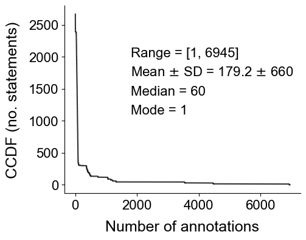
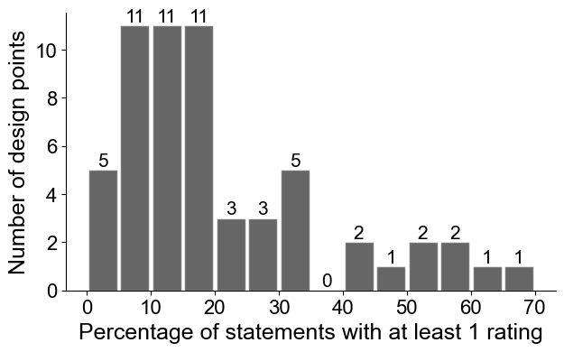
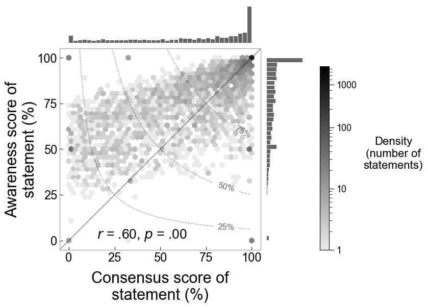
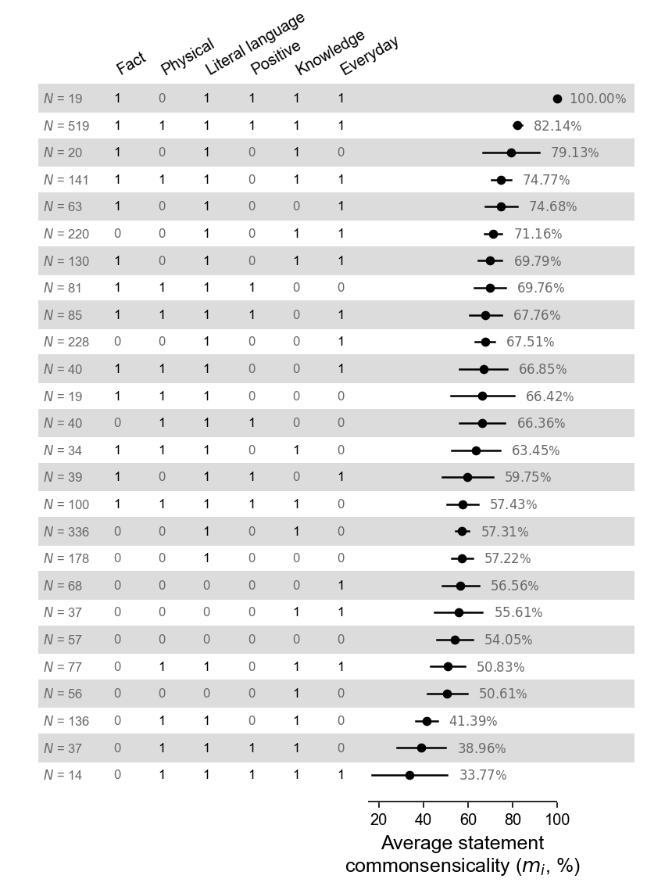
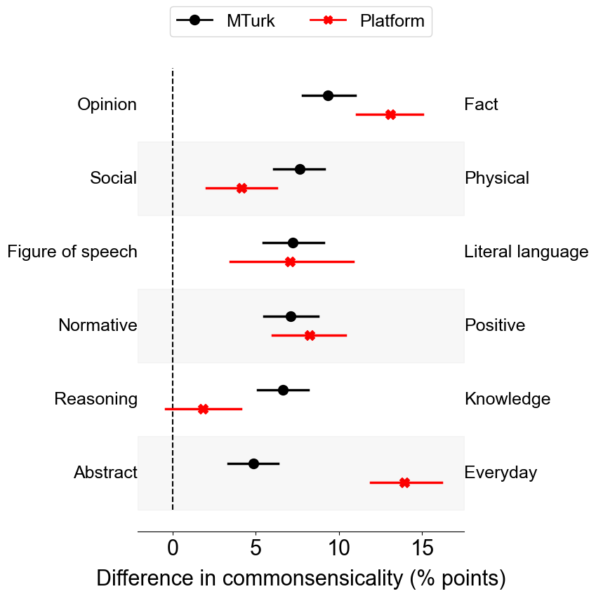
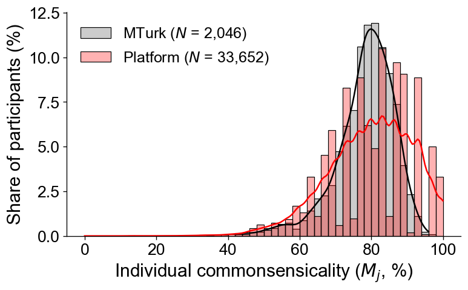
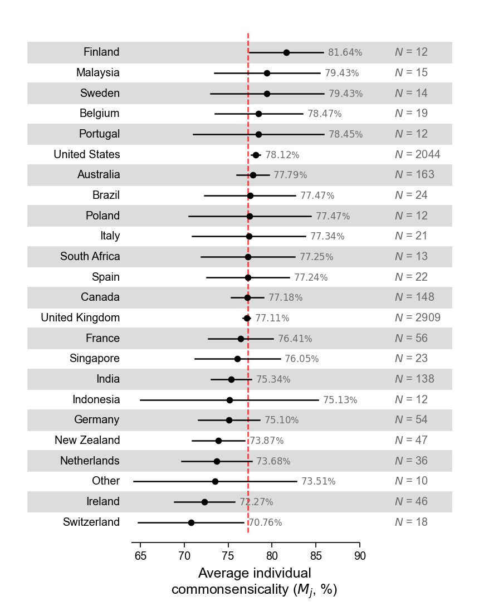
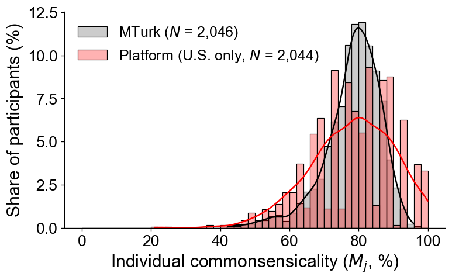

# Commonsense Platform

Updated May 20, 2025

## Descriptives

- Raw number of statements: 10,110
- Raw number of participants: 111,587
- Raw number of ratings: 795,077

When restricting to participants who gave at least 15 ratings.
- Number of statements (with at least 1 rating): 2,896
- Number of participants: 33,652
- Number of ratings/ratings: 518,869

All analyses below use data subject to this restriction.


### Number of ratings per statement



### Design points

Each design point is a combination of six binary values for the following statement features:

1. Fact (1) vs. opinion (0)
2. Physical (1) vs. social (0)
3. Literal language (1) vs. figure of speech (0)
4. Positive (1) vs. normative (0)
5. Knowledge (1) vs. reasoning (0)
6. Everyday (1) vs. abstract (0)

Therefore, there are a total of 64 design points.

Distribution of the number of statements in each design point:

- Range: [0, 1,767]
- Mean (SD): 157.97 (270.56)
- Median: 28
- Number of design points with no statements: 0

|   fact |   physical |   literal language |   positive |   knowledge |   everyday |   _N_ | _N_ (%), $~\geq$ 1 rating   | _N_ (%), $~\geq$ 100 ratings   |
|-------:|-----------:|-------------------:|-----------:|------------:|-----------:|:--------|:-----------|:-------------|
|      0 |          0 |                  1 |          0 |           0 |          1 |    1767 | 228 (12.9) | 45 (2.5)     |
|      0 |          0 |                  1 |          0 |           1 |          1 |     835 | 220 (26.3) | 39 (4.7)     |
|      1 |          1 |                  1 |          1 |           1 |          1 |     791 | 519 (65.6) | 52 (6.6)     |
|      0 |          0 |                  1 |          0 |           1 |          0 |     646 | 336 (52.0) | 29 (4.5)     |
|      0 |          0 |                  1 |          0 |           0 |          0 |     575 | 178 (31.0) | 33 (5.7)     |
|      1 |          0 |                  1 |          0 |           0 |          1 |     351 | 63 (17.9)  | 0 (0.0)      |
|      1 |          1 |                  1 |          1 |           0 |          0 |     343 | 81 (23.6)  | 0 (0.0)      |
|      1 |          0 |                  1 |          0 |           1 |          1 |     313 | 130 (41.5) | 40 (12.8)    |
|      0 |          0 |                  0 |          0 |           0 |          0 |     297 | 57 (19.2)  | 0 (0.0)      |
|      1 |          1 |                  1 |          0 |           1 |          1 |     278 | 141 (50.7) | 32 (11.5)    |
|      1 |          1 |                  1 |          1 |           0 |          1 |     258 | 85 (32.9)  | 1 (0.4)      |
|      0 |          0 |                  0 |          0 |           0 |          1 |     236 | 68 (28.8)  | 0 (0.0)      |
|      0 |          0 |                  0 |          0 |           1 |          0 |     231 | 56 (24.2)  | 0 (0.0)      |
|      0 |          1 |                  1 |          0 |           1 |          0 |     213 | 136 (63.8) | 15 (7.0)     |
|      1 |          1 |                  1 |          0 |           0 |          1 |     202 | 40 (19.8)  | 1 (0.5)      |
|      0 |          1 |                  1 |          1 |           0 |          0 |     180 | 40 (22.2)  | 0 (0.0)      |
|      1 |          1 |                  1 |          1 |           1 |          0 |     177 | 100 (56.5) | 15 (8.5)     |
|      0 |          1 |                  1 |          0 |           1 |          1 |     136 | 77 (56.6)  | 32 (23.5)    |
|      0 |          0 |                  0 |          0 |           1 |          1 |     132 | 37 (28.0)  | 1 (0.8)      |
|      1 |          0 |                  1 |          1 |           0 |          1 |     126 | 39 (31.0)  | 0 (0.0)      |
|      1 |          1 |                  1 |          0 |           0 |          0 |     125 | 19 (15.2)  | 0 (0.0)      |
|      0 |          1 |                  1 |          0 |           0 |          1 |     117 | 8 (6.8)    | 0 (0.0)      |
|      1 |          1 |                  1 |          0 |           1 |          0 |     104 | 34 (32.7)  | 0 (0.0)      |
|      1 |          0 |                  1 |          1 |           1 |          1 |     104 | 19 (18.3)  | 0 (0.0)      |
|      0 |          1 |                  1 |          0 |           0 |          0 |      85 | 9 (10.6)   | 0 (0.0)      |
|      0 |          1 |                  1 |          1 |           1 |          0 |      84 | 37 (44.0)  | 0 (0.0)      |
|      0 |          0 |                  1 |          1 |           0 |          1 |      80 | 7 (8.8)    | 0 (0.0)      |
|      0 |          1 |                  1 |          1 |           0 |          1 |      80 | 7 (8.8)    | 1 (1.2)      |
|      1 |          0 |                  1 |          0 |           0 |          0 |      76 | 5 (6.6)    | 0 (0.0)      |
|      0 |          1 |                  0 |          1 |           0 |          0 |      74 | 2 (2.7)    | 0 (0.0)      |
|      1 |          0 |                  1 |          0 |           1 |          0 |      65 | 20 (30.8)  | 0 (0.0)      |
|      1 |          1 |                  0 |          0 |           0 |          0 |      62 | 2 (3.2)    | 1 (1.6)      |
|      0 |          0 |                  1 |          1 |           0 |          0 |      62 | 4 (6.5)    | 0 (0.0)      |
|      1 |          1 |                  0 |          1 |           0 |          1 |      54 | 4 (7.4)    | 0 (0.0)      |
|      0 |          0 |                  0 |          1 |           0 |          0 |      54 | 0 (0.0)    | 0 (0.0)      |
|      0 |          0 |                  1 |          1 |           1 |          1 |      54 | 8 (14.8)   | 0 (0.0)      |
|      1 |          0 |                  1 |          1 |           0 |          0 |      50 | 3 (6.0)    | 0 (0.0)      |
|      1 |          1 |                  0 |          1 |           0 |          0 |      46 | 3 (6.5)    | 0 (0.0)      |
|      1 |          1 |                  0 |          0 |           0 |          1 |      46 | 3 (6.5)    | 0 (0.0)      |
|      0 |          1 |                  0 |          0 |           0 |          0 |      46 | 7 (15.2)   | 0 (0.0)      |
|      0 |          1 |                  0 |          0 |           0 |          1 |      46 | 1 (2.2)    | 0 (0.0)      |
|      1 |          0 |                  0 |          0 |           0 |          1 |      40 | 4 (10.0)   | 0 (0.0)      |
|      0 |          0 |                  1 |          1 |           1 |          0 |      38 | 6 (15.8)   | 0 (0.0)      |
|      0 |          1 |                  1 |          1 |           1 |          1 |      31 | 14 (45.2)  | 0 (0.0)      |
|      0 |          0 |                  0 |          1 |           0 |          1 |      30 | 4 (13.3)   | 0 (0.0)      |
|      1 |          0 |                  1 |          1 |           1 |          0 |      30 | 5 (16.7)   | 0 (0.0)      |
|      1 |          1 |                  0 |          0 |           1 |          1 |      28 | 4 (14.3)   | 0 (0.0)      |
|      1 |          0 |                  0 |          0 |           0 |          0 |      28 | 1 (3.6)    | 0 (0.0)      |
|      0 |          1 |                  0 |          0 |           1 |          0 |      28 | 5 (17.9)   | 0 (0.0)      |
|      0 |          0 |                  0 |          1 |           1 |          1 |      26 | 3 (11.5)   | 0 (0.0)      |
|      1 |          0 |                  0 |          0 |           1 |          1 |      22 | 1 (4.5)    | 0 (0.0)      |
|      1 |          0 |                  0 |          1 |           0 |          0 |      20 | 0 (0.0)    | 0 (0.0)      |
|      1 |          0 |                  0 |          0 |           1 |          0 |      20 | 3 (15.0)   | 0 (0.0)      |
|      0 |          1 |                  0 |          0 |           1 |          1 |      20 | 1 (5.0)    | 0 (0.0)      |
|      0 |          0 |                  0 |          1 |           1 |          0 |      20 | 3 (15.0)   | 0 (0.0)      |
|      1 |          0 |                  0 |          1 |           1 |          1 |      18 | 2 (11.1)   | 0 (0.0)      |
|      1 |          1 |                  0 |          0 |           1 |          0 |      18 | 0 (0.0)    | 0 (0.0)      |
|      1 |          0 |                  0 |          1 |           0 |          1 |      18 | 0 (0.0)    | 0 (0.0)      |
|      0 |          1 |                  0 |          1 |           1 |          0 |      18 | 2 (11.1)   | 0 (0.0)      |
|      0 |          1 |                  0 |          1 |           1 |          1 |      16 | 2 (12.5)   | 0 (0.0)      |
|      0 |          1 |                  0 |          1 |           0 |          1 |      16 | 1 (6.2)    | 1 (6.2)      |
|      1 |          1 |                  0 |          1 |           1 |          1 |      14 | 2 (14.3)   | 0 (0.0)      |
|      1 |          1 |                  0 |          1 |           1 |          0 |      10 | 0 (0.0)    | 0 (0.0)      |
|      1 |          0 |                  0 |          1 |           1 |          0 |       0 | 0 (N/A)    | 0 (N/A)      |

The above table summarizes these design points. Note:

- _N_: number of statements in each design point
- _N_ (%), $\geq$ 1 rating: number of statements in each design point with at least 1 rating
- Similar for _N_ (%), $\geq$ 100 ratings

Thus,

- There is 1 design point with no statements.
- There are 5 design points with at least 1 statement, but none of which has been rated. The "highest coverage", or highest percentage of statements that have been rated, is at 65.61%.
- There are 338 statements that have received at least 100 ratings each. These statements fall into 16 distinct design points.



## Commonsensicality

### Statement-level commonsensicality

|       |     Consensus |     Awareness |     Commonsensicality |
|:------|--------:|--------:|--------:|
| _N_ | 2896    | 2896    | 2896    |
| M  |   66.47 |   76.28 |   68.44 |
| SD   |   31.96 |   20.71 |   27.99 |
| min   |    0    |    0    |    0    |
| 25%   |   41.18 |   62.2  |   50.02 |
| 50%   |   76    |   80.13 |   74.45 |
| 75%   |   95.16 |   94.29 |   92.56 |
| max   |  100    |  100    |  100    |



#### Average statement commonsensicality by design point

The below table displays all design points, sorted by the number of statements each design point has. Note: only 58 design points are shown, because 6 design points either

- Have no statement at all, or
- Have some statements, but none of them has been rated by anyone

|   fact |   physical |   literal language |   positive |   knowledge |   everyday |   N |   Mean $m_i$ | 95% CI           |
|-------:|-----------:|-------------------:|-----------:|------------:|-----------:|----:|-------------:|:-----------------|
|      1 |          1 |                  1 |          1 |           1 |          1 | 519 |        82.14 | [80.20, 84.09]   |
|      0 |          0 |                  1 |          0 |           1 |          0 | 336 |        57.31 | [54.18, 60.45]   |
|      0 |          0 |                  1 |          0 |           0 |          1 | 228 |        67.51 | [63.25, 71.78]   |
|      0 |          0 |                  1 |          0 |           1 |          1 | 220 |        71.16 | [67.23, 75.09]   |
|      0 |          0 |                  1 |          0 |           0 |          0 | 178 |        57.22 | [52.50, 61.94]   |
|      1 |          1 |                  1 |          0 |           1 |          1 | 141 |        74.77 | [70.34, 79.20]   |
|      0 |          1 |                  1 |          0 |           1 |          0 | 136 |        41.39 | [36.58, 46.20]   |
|      1 |          0 |                  1 |          0 |           1 |          1 | 130 |        69.79 | [64.47, 75.11]   |
|      1 |          1 |                  1 |          1 |           1 |          0 | 100 |        57.43 | [50.44, 64.43]   |
|      1 |          1 |                  1 |          1 |           0 |          1 |  85 |        67.76 | [60.69, 74.84]   |
|      1 |          1 |                  1 |          1 |           0 |          0 |  81 |        69.76 | [62.72, 76.79]   |
|      0 |          1 |                  1 |          0 |           1 |          1 |  77 |        50.83 | [43.23, 58.43]   |
|      0 |          0 |                  0 |          0 |           0 |          1 |  68 |        56.56 | [48.42, 64.69]   |
|      1 |          0 |                  1 |          0 |           0 |          1 |  63 |        74.68 | [67.54, 81.83]   |
|      0 |          0 |                  0 |          0 |           0 |          0 |  57 |        54.05 | [46.04, 62.05]   |
|      0 |          0 |                  0 |          0 |           1 |          0 |  56 |        50.61 | [41.78, 59.45]   |
|      1 |          1 |                  1 |          0 |           0 |          1 |  40 |        66.85 | [56.22, 77.48]   |
|      0 |          1 |                  1 |          1 |           0 |          0 |  40 |        66.36 | [56.22, 76.51]   |
|      1 |          0 |                  1 |          1 |           0 |          1 |  39 |        59.75 | [48.47, 71.04]   |
|      0 |          1 |                  1 |          1 |           1 |          0 |  37 |        38.96 | [27.99, 49.92]   |
|      0 |          0 |                  0 |          0 |           1 |          1 |  37 |        55.61 | [44.79, 66.42]   |
|      1 |          1 |                  1 |          0 |           1 |          0 |  34 |        63.45 | [52.69, 74.20]   |
|      1 |          0 |                  1 |          0 |           1 |          0 |  20 |        79.13 | [66.46, 91.80]   |
|      1 |          1 |                  1 |          0 |           0 |          0 |  19 |        66.42 | [52.38, 80.45]   |
|      1 |          0 |                  1 |          1 |           1 |          1 |  19 |       100    | [100.00, 100.00] |
|      0 |          1 |                  1 |          1 |           1 |          1 |  14 |        33.77 | [16.90, 50.65]   |
|      0 |          1 |                  1 |          0 |           0 |          0 |   9 |        49.06 | [17.23, 80.89]   |
|      0 |          1 |                  1 |          0 |           0 |          1 |   8 |        94.1  | [80.14, 100.00]  |
|      0 |          0 |                  1 |          1 |           1 |          1 |   8 |        75    | [36.30, 100.00]  |
|      0 |          1 |                  0 |          0 |           0 |          0 |   7 |        73.77 | [45.67, 100.00]  |
|      0 |          0 |                  1 |          1 |           0 |          1 |   7 |        90.48 | [67.17, 100.00]  |
|      0 |          1 |                  1 |          1 |           0 |          1 |   7 |        97.46 | [93.17, 100.00]  |
|      0 |          0 |                  1 |          1 |           1 |          0 |   6 |        83.33 | [40.49, 100.00]  |
|      0 |          1 |                  0 |          0 |           1 |          0 |   5 |        73.14 | [35.91, 100.00]  |
|      1 |          0 |                  1 |          1 |           1 |          0 |   5 |        73.33 | [27.99, 100.00]  |
|      1 |          0 |                  1 |          0 |           0 |          0 |   5 |       100    | [100.00, 100.00] |
|      1 |          0 |                  0 |          0 |           0 |          1 |   4 |       100    | [100.00, 100.00] |
|      0 |          0 |                  0 |          1 |           0 |          1 |   4 |       100    | [100.00, 100.00] |
|      1 |          1 |                  0 |          0 |           1 |          1 |   4 |       100    | [100.00, 100.00] |
|      0 |          0 |                  1 |          1 |           0 |          0 |   4 |       100    | [100.00, 100.00] |
|      1 |          1 |                  0 |          1 |           0 |          1 |   4 |        91.54 | [64.61, 100.00]  |
|      1 |          1 |                  0 |          1 |           0 |          0 |   3 |        44.44 | [0.00, 100.00]   |
|      0 |          0 |                  0 |          1 |           1 |          1 |   3 |       100    | [100.00, 100.00] |
|      1 |          0 |                  1 |          1 |           0 |          0 |   3 |       100    | [100.00, 100.00] |
|      1 |          0 |                  0 |          0 |           1 |          0 |   3 |       100    | [100.00, 100.00] |
|      0 |          0 |                  0 |          1 |           1 |          0 |   3 |        66.67 | [0.00, 100.00]   |
|      1 |          1 |                  0 |          0 |           0 |          1 |   3 |        66.67 | [0.00, 100.00]   |
|      0 |          1 |                  0 |          1 |           1 |          0 |   2 |       100    | [100.00, 100.00] |
|      0 |          1 |                  0 |          1 |           0 |          0 |   2 |        50    | [0.00, 100.00]   |
|      1 |          1 |                  0 |          0 |           0 |          0 |   2 |        45.22 | [0.00, 100.00]   |
|      1 |          1 |                  0 |          1 |           1 |          1 |   2 |       100    | [100.00, 100.00] |
|      0 |          1 |                  0 |          1 |           1 |          1 |   2 |       100    | [100.00, 100.00] |
|      1 |          0 |                  0 |          1 |           1 |          1 |   2 |        50    | [0.00, 100.00]   |
|      0 |          1 |                  0 |          1 |           0 |          1 |   1 |         2.41 | N/A              |
|      1 |          0 |                  0 |          0 |           0 |          0 |   1 |       100    | N/A              |
|      1 |          0 |                  0 |          0 |           1 |          1 |   1 |       100    | N/A              |
|      0 |          1 |                  0 |          0 |           1 |          1 |   1 |       100    | N/A              |
|      0 |          1 |                  0 |          0 |           0 |          1 |   1 |       100    | N/A              |

The below table displays 26 design points with at least 10 statements. The design points are sorted by the average statement commonsensicality.



#### Statement commonsensicality by statement features




The below table is the result of a regression analysis where:

- Response variable: statement commonsensicality
- Predictors: 6 binary features

Thus, the reference class is:
- Opinion
- Social
- Figure of speech
- Normative
- Reasoning
- Abstract

```txt
                 Generalized Linear Model Regression Results                  
==============================================================================
Dep. Variable:                    m_i   No. Observations:                 2896
Model:                            GLM   Df Residuals:                     2890
Model Family:                Gaussian   Df Model:                            5
Link Function:               Identity   Scale:                          970.47
Method:                          IRLS   Log-Likelihood:                -14065.
Date:                Tue, 20 May 2025   Deviance:                   2.8047e+06
Time:                        14:45:24   Pearson chi2:                 2.80e+06
No. Iterations:                     3   Pseudo R-squ. (CS):            -0.2102
Covariance Type:            nonrobust                                         
====================================================================================
                       coef    std err          z      P>|z|      [0.025      0.975]
------------------------------------------------------------------------------------
fact                 5.9213      1.607      3.684      0.000       2.771       9.071
physical            -3.3618      1.579     -2.128      0.033      -6.458      -0.266
literal language    47.2044      1.259     37.508      0.000      44.738      49.671
positive             4.4717      1.659      2.695      0.007       1.220       7.723
knowledge            9.4575      1.228      7.701      0.000       7.051      11.864
everyday            20.4300      1.221     16.727      0.000      18.036      22.824
====================================================================================
```

### Indidivual-level commonsensicality



Summary of individual commonsensicality in two human samples.

|       |   MTurk |   Platform |
|------:|:--------|:-----------|
| _N_ | 2,046    |   33,652    |
| M  |   78.39 |      79.75 |
| SD   |    8.13 |      11.95 |
| min   |   42.33 |       0    |
| 25%   |   74.46 |      73.03 |
| 50%   |   79.43 |      80    |
| 75%   |   83.98 |      89.94 |
| max   |   96    |     100    |

Mann-Whitney U Test (Wilcoxon rank-sum test for 2 independent samples)

- $U_1$ = 37,937,053.0
- $p$ = 8.2e-15
- AUC = 0.551

Independent samples t-test (with unequal variance)

- $t(2614.3)$ = 7.146
- $p$ = 1.16e-12
- $d$ = 1.116

Thus, the average commonsensicality score of people recruited on the platform is higher than the same score of people in the MTurk sample.

#### Average individual commonsensicality by country




#### U.S. participants: MTurk vs. platform




|       |   MTurk |   Platform (U.S. only) |
|:------|--------:|-----------------------:|
| count | 2046    |                2044    |
| mean  |   78.39 |                  78.12 |
| std   |    8.13 |                  12.11 |
| min   |   42.33 |                  21.08 |
| 25%   |   74.46 |                  69.92 |
| 50%   |   79.43 |                  79.72 |
| 75%   |   83.98 |                  86.67 |
| max   |   96    |                 100    |

Mann-Whitney U Test (Wilcoxon rank-sum test for 2 independent samples)

- $U_1$ = 2,091,041.5
- $p$ = 0.999
- AUC = 0.500

Independent samples t-test (with unequal variance)

- $t(2614.3)$ = -0.824
- $p$ = 0.4099
- $d$ = -0.026

Thus, the average commonsensicality scores in the two U.S. samples are statistically indistinguishable.
